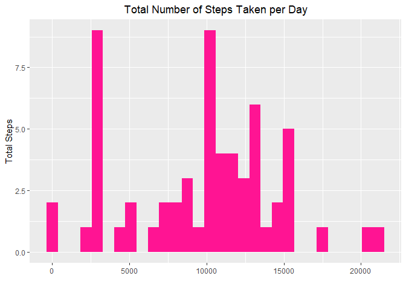

``` r
library(dplyr)
library(ggplot2)
library(VIM)
```


## Loading and preprocessing the data
<br>
First load the data into `activity` variable. 

``` r
activity <- read.csv(unzip("activity.zip","activity.csv"))
head(activity)
```

```
##   steps       date interval
## 1    NA 2012-10-01        0
## 2    NA 2012-10-01        5
## 3    NA 2012-10-01       10
## 4    NA 2012-10-01       15
## 5    NA 2012-10-01       20
## 6    NA 2012-10-01       25
```
From the data we can see that there is a variable called date. It would be very 
convenient if it would be a **Date** class.


``` r
class(activity$date)
```

```
## [1] "character"
```

We can see `acitiviy$date` variable is not a **Date** class rather a **character** 
class. So, we need to convert `acitiviy$date` into **Date** class.


``` r
activity$date <- as.Date(activity$date)
```
Now we can use this data for our analysis properly.
<br>
<br>

## What is mean total number of steps taken per day?


``` r
total_steps_per_day <- group_by(activity,date) %>%
                       summarise(total_steps=sum(steps,na.rm = TRUE))
g_tot <- ggplot(total_steps_per_day,aes(x=date,y=total_steps))
g_tot + 
  geom_col(fill="deeppink") + 
  labs(title= "Total Number of Steps Taken per Day",x="",y="Total Steps")+
  theme(plot.title = element_text(hjust=0.5))
```

<!-- -->

#### Mean Steps per Day

``` r
mean_steps_per_day <- mean(total_steps_per_day$total_steps,na.rm = T)
mean_steps_per_day
```

```
## [1] 9354.23
```

Mean steps per day is 9354.23

#### Median Steps per Day

``` r
median_steps_per_day <- median(total_steps_per_day$total_steps,na.rm = T)
median_steps_per_day
```

```
## [1] 10395
```

Median steps per day is 10395

## What is the average daily activity pattern?

``` r
daily_avg <- group_by(activity,interval) %>% 
             summarise(avg_steps=mean(steps,na.rm = T))

max_step <- daily_avg[which.max(daily_avg$avg_steps),]
print(max_step)
```

```
## # A tibble: 1 × 2
##   interval avg_steps
##      <int>     <dbl>
## 1      835      206.
```

``` r
g_daily <- ggplot(daily_avg,aes(x=interval,avg_steps))
g_daily +
  geom_line() +
  labs(title="Daily Average Steps",x="",y="Average Steps") +
  theme(plot.title = element_text(hjust=0.5))
```

<!-- -->

Maximum mean daily interval is 835  with 206. steps.


## Imputing missing values


``` r
sum(is.na(activity))
```

```
## [1] 2304
```
There are total number of 2304 NA values in the data set.


Imputing strategy used here is K-Nearest Neighbor. Nearest 6 row of each row is calculated by euclidean method and then the most likely value has been taken from the nearest rows. Imputed version of total dataset is assigned to new variable `activity_imp`.


``` r
activity_imp <- kNN(activity,variable = c("steps"),k=6,imp_var = F)

total_imp <- group_by(activity_imp,date) %>%
                      summarise(total_steps=sum(steps,na.rm = TRUE))
g_tot_imp <- ggplot(total_imp,aes(x=date,y=total_steps))
g_tot_imp + 
  geom_col(fill="deeppink") + 
  labs(title= "Total Number of Steps Taken per Day",x="",y="Total Steps")+
  theme(plot.title = element_text(hjust=0.5))
```

<!-- -->


From the title we can see that some of the days had missing values and in turn missing columns but after imputation those columns has been filled with values.


``` r
mean_imp <- mean(total_imp$total_steps,na.rm = T)

mean_imp
```

```
## [1] 9722.754
```

``` r
median_imp <- median(total_imp$total_steps,na.rm=T)

median_imp
```

```
## [1] 10395
```

After imputation mean steps per day is 9722.754 and median steps per day is 10395.
Though mean has changed in fact increased the median has not changed. The imputation technique did not impact median value.


## Are there differences in activity patterns between weekdays and weekends?


``` r
days <- weekdays(activity_imp$date)
day_names <- weekdays(as.Date(4,"1970-01-01",tz="GMT")+0:6)
activity_imp$day <- factor(days,levels=day_names,
            labels =c(rep("weekday",5),rep("weekend",2)))

days_activity <- group_by(activity_imp,day,interval) %>%
                  summarise(mean_steps=mean(steps))
g_days <- ggplot(days_activity,aes(x=interval,y=mean_steps))
g_days +
  geom_line()+
  labs(title="Activity Patterns Between Weekdays and Weekends",x="",y="Mean steps")+
  theme(plot.title = element_text(hjust=0.5))+
  facet_wrap(vars(day),nrow=2,ncol=1,strip.position="top")
```

<!-- -->

From the plot we can see there is a clear contrast in average steps between weekday and weekend.
